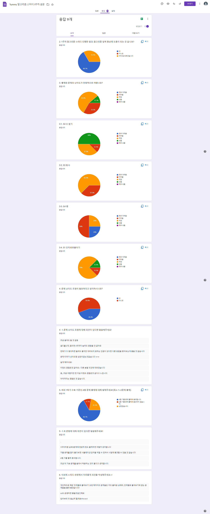

## 최종 선정

1. 트리
2. 분할 정복
3. DP, 배낭(knapsack)
4. 그래프 + 시뮬

- S1 트리 순회
  https://www.acmicpc.net/problem/1991

- S1 1992 쿼드트리 / 분할 정복
  https://www.acmicpc.net/problem/1992

- G5 12865 평범한 배낭 / DP, 배낭 문제
  https://www.acmicpc.net/problem/12865

- G4 14502 연구소 / 구현 , 그래프 탐색
  https://www.acmicpc.net/problem/14502

---

### 후보

S2 14889 스타트와 링크 / 브루트 포스, 백트랙킹
https://www.acmicpc.net/problem/14889

G4 14502 연구소 / 구현 , 그래프 탐색
https://www.acmicpc.net/problem/14502

G5 12865 평범한 배낭 / DP, 배낭 문제
https://www.acmicpc.net/problem/12865

G4 15683 감시 / 구현, 브루트 포스
https://www.acmicpc.net/problem/15683

S1 1992 쿼드트리 / 분할 정복
https://www.acmicpc.net/problem/1992

S1 트리 순회
https://www.acmicpc.net/problem/1991

---

## 설문 결과

